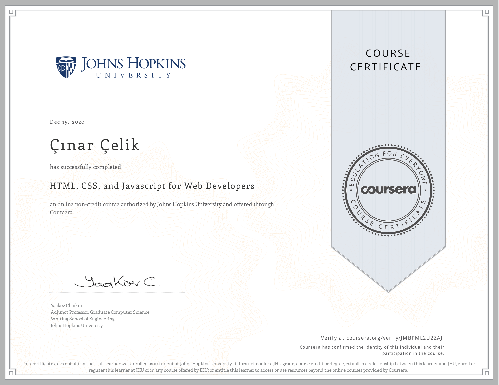

# jhu-webdev-coursera
Assignment submission repository for Mr. Yaakov Chaikin's "HTML, CSS and JS for Web Developers" course on Coursera.

I am following the course using Git Bash on my Windows to get used to Git commands, instead of using GitHub Desktop as I usually do.

The links for the assignment solutions are: 
- https://cinarcelik.github.io/jhu-webdev-coursera/module-2-assignment
- https://cinarcelik.github.io/jhu-webdev-coursera/module-3-assignment
- https://cinarcelik.github.io/jhu-webdev-coursera/module-4-assignment
- https://cinarcelik.github.io/jhu-webdev-coursera/module-5-assignment

